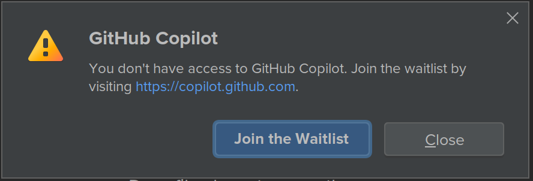

# Getting Started with GitHub Copilot in JetBrains 


- [Installing the JetBrains extension](#installing)
- [Seeing your first suggestion](#first-suggestion)
- [Choosing alternate suggestions](#alternates)
- [Getting more suggestions](#more-suggestions)
- [Generating code from a comment](#code-from-comment)
- [More examples](#more-examples)
- [Keyboard shortcuts](#shortcuts)
- [Enabling or disabling GitHub Copilot](#enabling)
- [Learn More](#more)

<a name="installing"></a>
## 1. Installing the JetBrains extension

1. We have tested with the following JetBrains IDEs: IntelliJ and PyCharm versions 2021.2 and above.
2. From Settings/Preferences > Plugins, in the JetBrains marketplace, search for 'github copilot'.  (You must include the 'github' to avoid other plug-ins with similar names.)

   

3. Click the 'Install' button.
4. Accept the Third-Party Plugins Privacy Notice.
5. Exit and restart the IDE.

6. In the Tools menu you will now see a GitHub Copilot option.

   
  
7. Login to GitHub Copilot using the device auth flow and authorized GitHub Copilot IntelliJ plugin with your GitHub Account in an external browser.
8. Read and agree to the GitHub Copilot additional telemetry terms.
9. Click `OK`.

   Now when you start editing, you should see GitHub Copilot suggestions.

   If you receive the following message, you have not yet been added to the GitHub Copilot Technical Preview.

   </img>

   The Technical Preview is open to a limited number of testers. To join the 
   waitlist, visit [copilot.github.com](https://copilot.github.com).

   Having problems installing? Visit the [Feedback forum](https://github.com/github/feedback/discussions/categories/copilot-feedback).

<a name="first-suggestion"></a>
## 2. Seeing your first suggestion

GitHub Copilot provides code suggestions for dozens of languages and a wide variety of frameworks, 
but it works especially well for Python, JavaScript, TypeScript, Ruby, Java, and Go. 
The following samples are in Java, but other languages will work similarly.

1. Create a new Java (.java) file.
2. Create a class by typing
```class Test ```

   Copilot will suggest a class body.

   </img>
   
   Press `tab` to accept the suggestion.

3. Below the bracket of the `main` function, type the following function header:

   ```
   int calculateDaysBetweenDates(
   ```

3. GitHub Copilot will automatically suggest an entire function body in grayed text, as shown below. 
The exact suggestion may vary.

   </img>

4. Press `Tab` to accept the suggestion.

GitHub Copilot will attempt to match your code's context and style. You can edit the suggested code as you choose.

<a name="alternates"></a>
## 3. Choosing alternate suggestions

For any given input, GitHub Copilot can provide multiple suggestions. 
As the developer you are always in charge; you can select which suggestion to use, or reject them all.

1. Remove the function you entered and type the following again:

   ```
   int calculateDaysBetweenDates(
   ```

2. GitHub Copilot will again show you a suggested completion.

3. Instead of pressing `Tab`:
   * On macOS, press `Option`+`]` for next or `Option`+`[` for previous.
   * On Windows or Linux, press `Alt`+`]` for next or `Alt`+`[` for previous.

   GitHub Copilot will cycle through other alternative suggestions.

4. When you see a suggestion you like, press `Tab` to accept it.

5. If you don't like any of the suggestions, press `Esc`.

<a name="more-suggestions"></a>
## 4. Getting more suggestions

Sometimes, you may not want to use any of the initial suggestions. 
You can ask GitHub Copilot to return more.

1. Remove the function you entered and type the following again:

   ```
   int calculateDaysBetweenDates(
   ```

2. GitHub Copilot will again show you a suggested completion.

3. Open GitHub Copilot.
   * On macOS, press `Option`+`Enter`.
   * On Windows or Linux, press `Alt`+`Enter`.

   </img>

   Select "Open Copilot". GitHub Copilot will open a new tab and suggest multiple options, as shown below.

   </img>

4. Pick a suggestion that you want to use, then click "Accept solution."

5. If you don't like any of the returned suggestions, just close the suggestions tab.

<a name="code-from-comment"></a>
## 5. Generating code from a comment

GitHub Copilot can understand significantly more context than most code assistants, 
and can generate entire functions from something as simple as a comment. 

1. Remove the function you entered and type the following:

   ```
   // find all images without alternate text
   // and give them a red border
   void process() {
   ```

2. GitHub Copilot will automatically suggest an implementation:

   </img>

<a name="more-examples"></a>
## 6. More examples

GitHub Copilot has even more capabilities. 
Check out the examples on [copilot.github.com](https://copilot.github.com) to see more, 
or the [Gallery](../../gallery) in 
this repository for the latest examples from us and the community.

Got an example of your own? We welcome you to share it on our [Feedback forum](https://github.com/github/feedback/discussions/categories/copilot-feedback).

<a name="shortcuts"></a>
## 7. Keyboard shortcuts

The following lists the most common keyboard shortcuts relevant for GitHub
Copilot. If you wish to rebind them, check out [the configuration guide](configuring.md).

* Accept an inline suggestion: `Tab`.

* Dismiss an inline suggestion: `Esc`.

* Show next inline suggestion: `Alt + ]` or `Option + ]`.

* Show previous inline suggestion: `Alt + [` or `Option + [`.

* Trigger inline suggestion: `Alt + \` or `Option + \`.

* Open Copilot (up to 10 suggestions in separate pane): `Alt + Enter` or `Option + Enter` then pick "Open Copilot".

<a name="enabling"></a>
## 8. Enabling and disabling GitHub Copilot

There's a setting to turn on or off the automatic completions. You can find the setting at `Preferences... > Languages & Frameworks > GitHub Copilot`.

   </img>

You can also logout (or login) from Copilot from the `Tools`/`GitHub Copilot` menu.

   </img>

<a name="more"></a>
## 9. Learn More

To learn more about configuring GitHub Copilot, go to the [documentation table of
contents](README.md).
