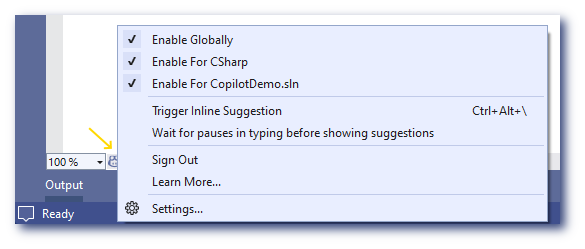
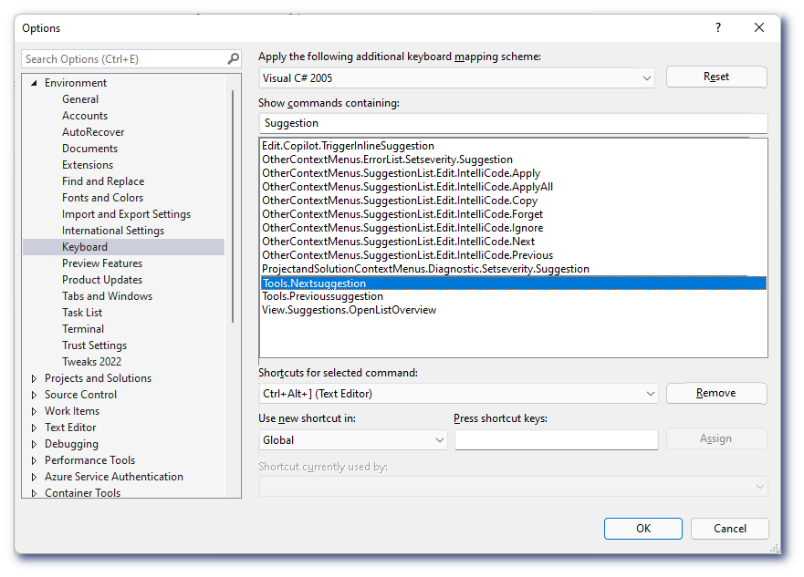

# Configuring GitHub Copilot for Visual Studio

# Settings for the Extension

To configure GitHub Copilot's basic settings, click the GitHub Copilot status icon in the bottom panel of the Visual Studio window. To enable or disable GitHub Copilot, click the icon. You will be asked whether you wish to toggle globally, for the current file type, or current solution.

</img>

## Keyboard shortcuts

These are the most common Visual Studio keyboard shortcuts relevant for GitHub
Copilot.
If you wish to rebind the shortcuts, use the Tools | Options, Environment > Keyboard section and search for the command name below:

* Show next inline suggestion: `Ctrl + Alt + ]`.
   `Tools.Nextsuggestion`

* Show previous inline suggestion: `Ctrl + Alt + [`.
   `Tools.Previoussuggestion`

* Trigger inline suggestion: `Ctrl + Alt + \`.
   `Edit.Copilot.TriggerInlineSuggestion`
   

</img>

## Learn More

To learn more about GitHub Copilot, go to the [documentation table of
contents](README.md).

