# Getting Started with GitHub Copilot in Visual Studio

- [Getting Started with GitHub Copilot in Visual Studio](#getting-started-with-github-copilot-in-visual-studio)
  - [Prerequisites](#prerequisites)
  - [1. Installing the Visual Studio extension](#1-installing-the-visual-studio-extension)
  - [2. Seeing your first suggestion](#2-seeing-your-first-suggestion)
  - [3. Choosing alternate suggestions](#3-choosing-alternate-suggestions)
  - [4. Generating code from a comment](#4-generating-code-from-a-comment)
  - [6. More examples](#6-more-examples)
  - [7. Keyboard shortcuts](#7-keyboard-shortcuts)
  - [8. Enabling and disabling GitHub Copilot](#8-enabling-and-disabling-github-copilot)
  - [9. Learn More](#9-learn-more)

<a name="installing"></a>

## Prerequisites

- You will need VS 2022 17.1 or later: https://devblogs.microsoft.com/visualstudio/visual-studio-2022-17-1-is-now-available/

## 1. Installing the Visual Studio extension

To use GitHub Copilot, you first need to install the Visual Studio extension.

1. Open Visual Studio. 

2. In Extensions | Manage Extensions, from the Visual Studio Marketplace, install the GitHub Copilot extension for Visual Studio.

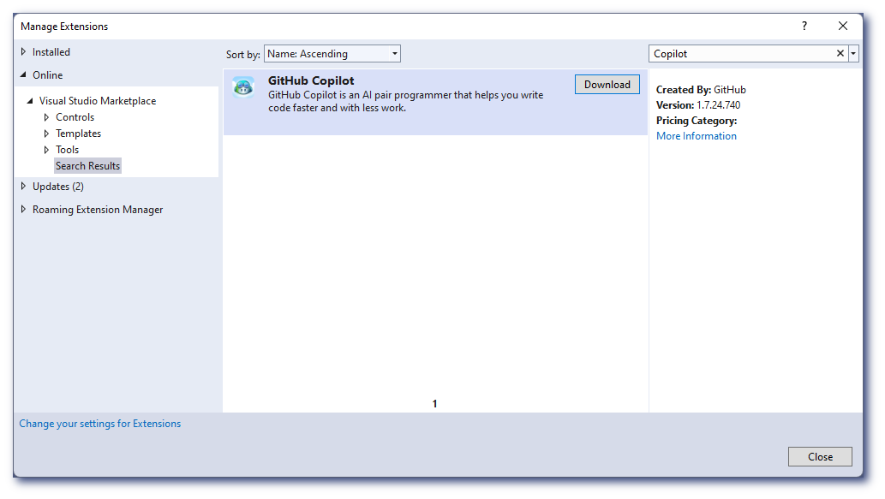</img>


3. Close the dialog, then exit and relaunch Visual studio.

</img>

4. After restarting Visual Studio, use Extensions | Manage Extensions | Installed to confirm that the GitHub Copilot extension is installed and enabled.

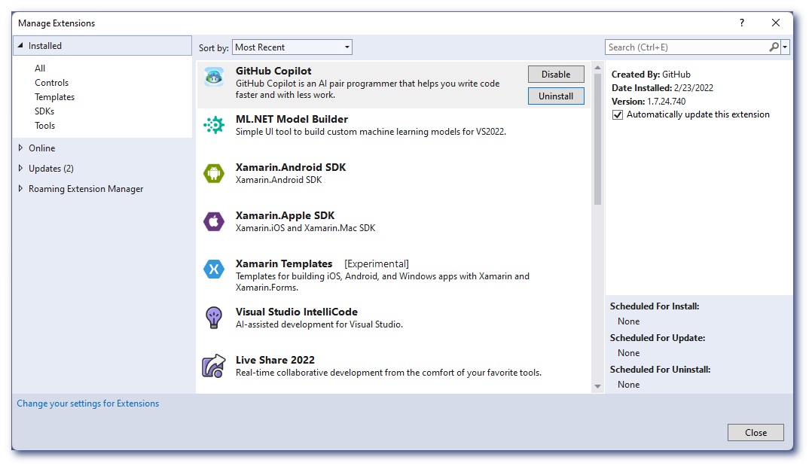</img>

Having problems installing? Visit the [Feedback forum](https://github.com/github/feedback/discussions/categories/copilot-feedback).

<a name="first-suggestion"></a>
## 2. Seeing your first suggestion

GitHub Copilot provides suggestions for dozens of languages and a wide variety of frameworks, 
but it works especially well for Python, JavaScript, TypeScript, Ruby, Go, C#, and C++. 
The following samples are in C#, but other languages will work similarly.

1. Create a new C# Console App project by following the instructions in steps 1 and 2 [here](https://docs.microsoft.com/en-us/visualstudio/get-started/csharp/tutorial-console?view=vs-2022#:~:text=1%20Tutorial%3A%20Create%20a%20simple%20C%23%20console%20app,yet%20have%20fail%20safes%20in%20place%20to%20).  

2. Name your project "Copilot Demo".

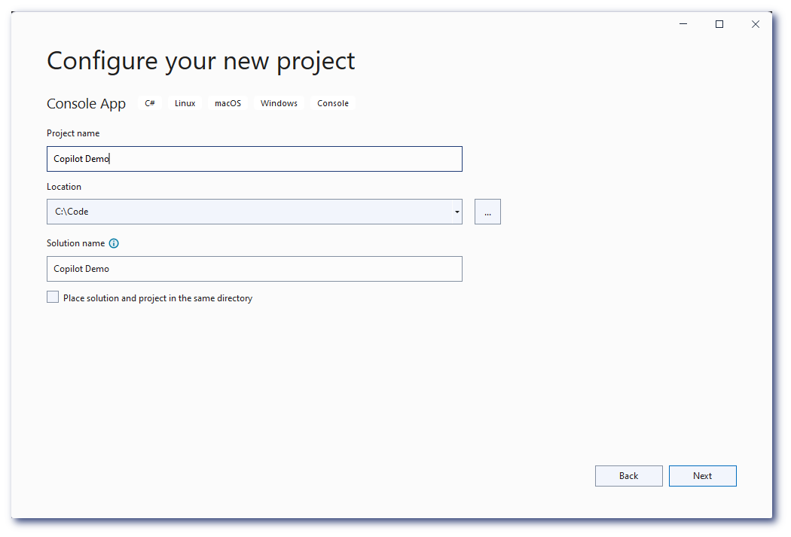</img>

3. Click "Next".

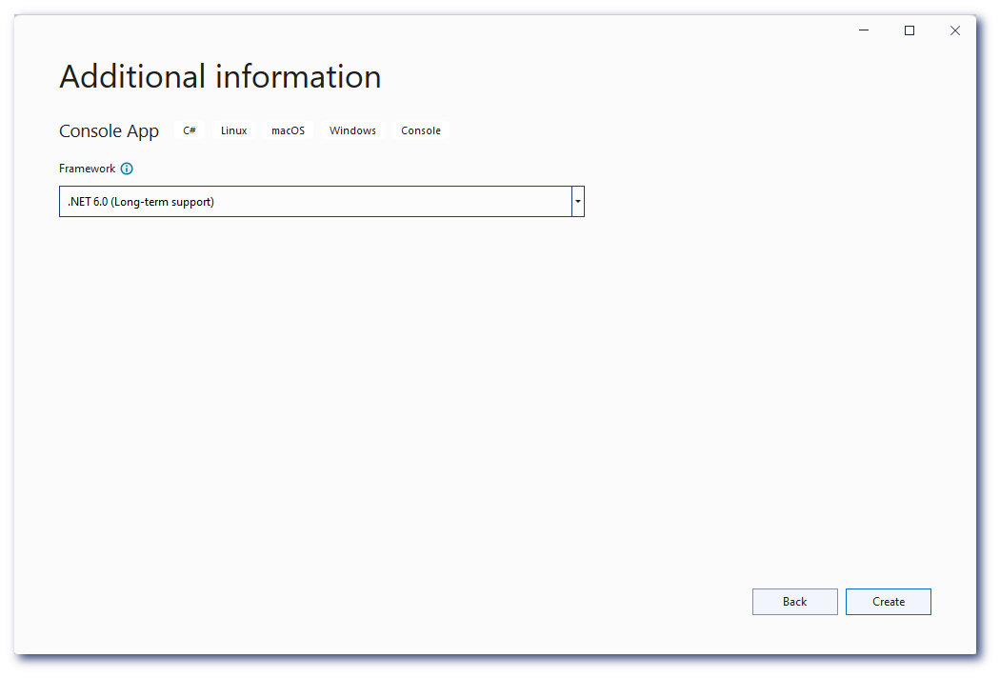</img>

4. Click "Create".

   1. The very first run, you will be presented with a message to activate your connection to GitHub

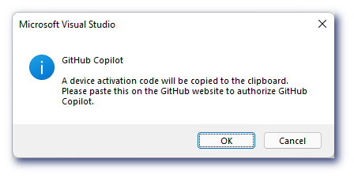</img>

   2. A device code will be copied automatically to the clipboard. Paste it on the GitHub device authorization page that will open. If you miss the device code, you will find it in the status bar, at the bottom left of Visual Studio, as well as on the GitHub Copilot output window pane.
   
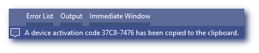</img>
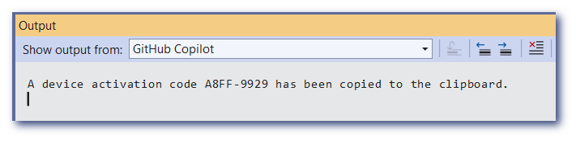</img>
   
   3. After successful authorization, proceed to read and approve the [telemetry terms](https://github.co/copilot-telemetry-terms).

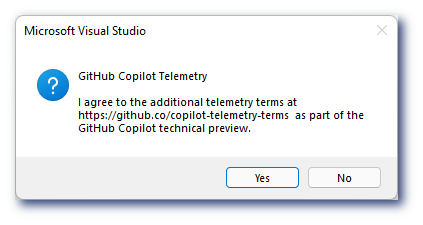</img>

After installation, a GitHub Copilot icon should appear in the editor margin at the bottom of your Visual Studio window, in the lower left.

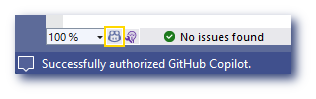</img>

and your file should show short "Hello, World!" code.

</img>

1. Below that, type the following function header:

   ```
   int CalculateDaysBetweenDates(
   ```

2. GitHub Copilot will automatically suggest an entire function body in grayed text, as shown below. 
The exact suggestion may vary.

   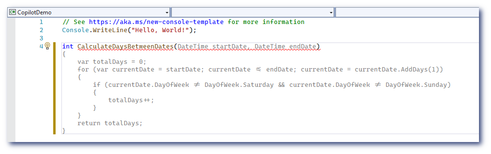</img>

7. Press `Tab` to accept the suggestion.

GitHub Copilot will attempt to match your code's context and style. You can edit the suggested code as you choose.

<a name="alternates"></a>
## 3. Choosing alternate suggestions

For any given input, GitHub Copilot can provide multiple suggestions. 
As the developer you are always in charge; you can select which suggestion to use, or reject them all.

1. Clear the file (or start a new one), and type the following again:

   ```
   int CalculateDaysBetweenDates(
   ```

2. GitHub Copilot will again show you a suggested completion.

3. Instead of pressing `Tab`, press `Alt`+`.` (or `Alt`+`,`).

   GitHub Copilot will cycle through other alternative suggestions.

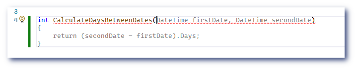</img>

4. When you see a suggestion you like, press `Tab` to accept it.

5. If you don't like any of the suggestions, press `Esc`.

You can also hover over a suggestion to see the GitHub Copilot command palette for choosing suggestions.

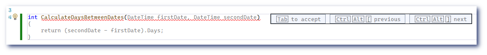</img>

<a name="more-suggestions"></a>

## 4. Generating code from a comment

GitHub Copilot can understand significantly more context than most code assistants, 
and can generate entire functions from something as simple as a comment. 

1. Clear the file (or start a new one), and type the following:

   ```csharp
   using System.Xml.Linq;

   var doc = XDocument.Load("index.xhml");
   
   // find all images
   ```

   Press `Enter`.

2. GitHub Copilot will automatically suggest an implementation. Press "tab" to accept it.

2. Enter a second comment

   ```csharp
   // and give them a red border
   ```

   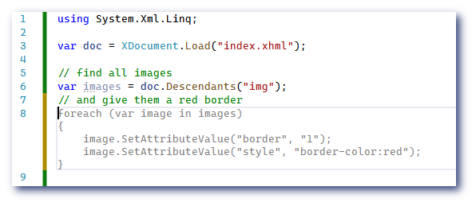</img>

<a name="using-a-framework"></a>

## 6. More examples

GitHub Copilot can do even more. 
Check out the examples on [copilot.github.com](https://copilot.github.com) to see more, 
or the [Gallery](../../gallery) in 
this repository for the latest examples from us and the community.

Got an example of your own? We welcome you to share it on our [Feedback forum](https://github.com/github/feedback/discussions/categories/copilot-feedback).

<a name="shortcuts"></a>
## 7. Keyboard shortcuts

The following lists the most common keyboard shortcuts relevant for GitHub
Copilot. If you wish to rebind them, check out [the configuration guide](configuring.md).

* Accept an inline suggestion: `Tab`.

* Dismiss an inline suggestion: `Esc`.

* Show next inline suggestion: `Alt + .`.

* Show previous inline suggestion: `Alt + ,`.

* Trigger inline suggestion: `Ctrl + Alt + \`.

<a name="enabling"></a>
## 8. Enabling and disabling GitHub Copilot

The GitHub Copilot status icon in the bottom panel of the Visual Studio window
indicates whether GitHub Copilot is enabled or disabled. It will have a diagonal line through it when disabled. To enable or disable GitHub Copilot, click the icon. You will be
asked whether you wish to toggle for the current file, current file type, or globally.

</img>

<a name="more"></a>
## 9. Learn More

To learn more about configuring GitHub Copilot, go to the [documentation table of
contents](README.md).
