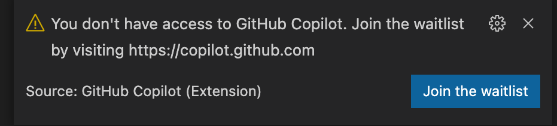
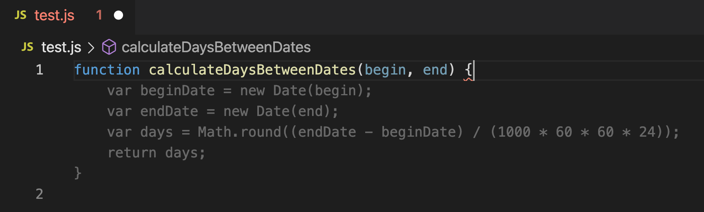
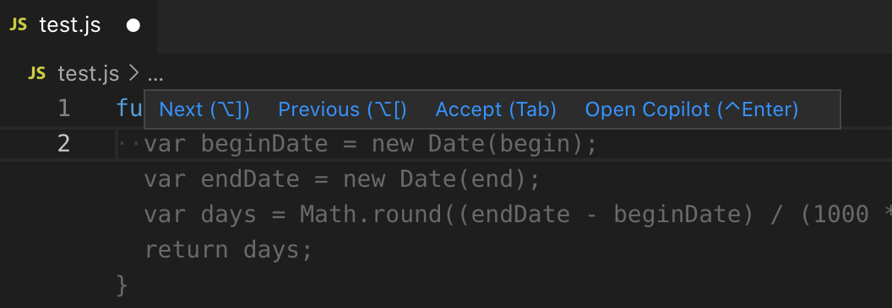
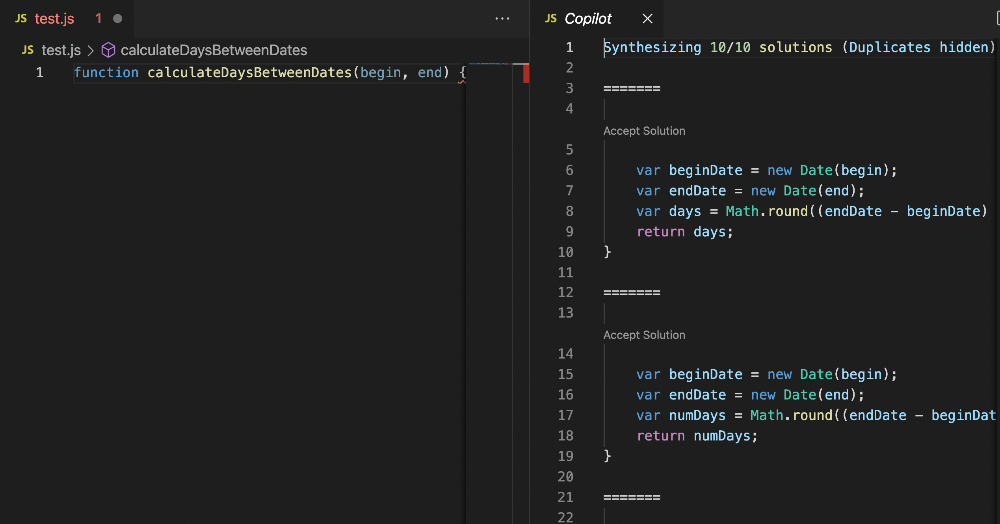
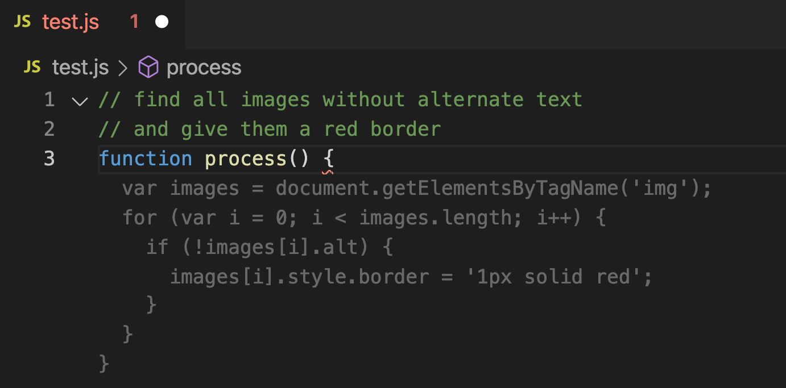

# 在 Visual Studio Code 中开始使用 GitHub Copilot

[English](./gettingstarted.md) | 简体中文

- [安装 Visual Studio Code 扩展](#installing)
- [看看你的第一个建议](#first-suggestion)
- [选择备用建议](#alternates)
- [获得更多建议](#more-suggestions)
- [从注释中生成代码](#code-from-comment)
- [使用一个框架](#using-a-framework)
- [更多示例](#more-examples)
- [键盘快捷键](#shortcuts)
- [启用或禁用 GitHub Copilot](#enabling)
- [了解更多](#more)

<a name="installing"></a>
## 1. 安装 Visual Studio Code 扩展

要使用 GitHub Copilot，首先需要安装 Visual Studio Code 扩展。

1. 访问 Visual Studio Code Marketplace 上的 [GitHub Copilot extension](https://marketplace.visualstudio.com/items?itemName=GitHub.copilot) 页面并安装该扩展。
2. 打开 Visual Studio Code，你会被提示通过登录 GitHub 来授权该扩展。

   </img>

3. 在你授权扩展后，你将返回到 Visual Studio Code。

如果你收到以下提示，说明你还没有被加入到 GitHub Copilot 技术预览中。技术预览对有限数量的测试者开放，要加入等待名单，请访问 [copilot.github.com](https://copilot.github.com) 。

</img>

安装完成后，Visual Studio Code 窗口底部的状态面板上会出现一个 GitHub Copilot 图标。

安装时遇到问题？请访问 [反馈论坛](https://github.com/github/feedback/discussions/categories/copilot-feedback) 。

<a name="first-suggestion"></a>
## 2. 看看你的第一个建议

GitHub Copilot 为几十种语言和各种框架提供建议。尤其对 Python、JavaScript、TypeScript、Ruby 和 Go 的效果很棒。
以下是 JavaScript 的例子，其他语言也有类似的效果。

1. 创建一个新的 JavaScript（.js）文件。
2. 输入以下函数头。

   ```javascript
   function calculateDaysBetweenDates(begin, end) {
   ```

3. GitHub Copilot 会用灰色文本自动给出整个函数体的建议，如下图所示。具体建议可能有所不同。

   </img>

4. 按下 `Tab` 接受建议。

GitHub Copilot 将尝试匹配你的代码的上下文和风格，你可以根据你的喜好来编辑建议的代码。

<a name="alternates"></a>
## 3. 选择备用建议

对于任何给定的输入，GitHub Copilot 可以提供多种建议。作为开发者，你始终有权利选择使用哪个建议，或拒绝所有建议。

1. 清除该文件（或启动一个新的文件），并再次输入以下内容。

   ```javascript
   function calculateDaysBetweenDates(begin, end) {
   ```

2. GitHub Copilot 会再次向你展示建议。

3. 这次不再按 `Tab` :
   * 在 macOS 上， 按 `Option (⌥)` + `]` 或 `Option (⌥)` + `[`
   * 在 Windows 或 Linux上，按 `Alt` + `]` 或 `Alt` + `[`

   GitHub Copilot 将循环展示其他的备用建议。

4. 当你看到一个你喜欢的建议时，按 `Tab` 来接受它。

5. 如果你不喜欢任何建议，按 `Esc` 。

你也可以将鼠标悬停在一个建议上，查看 GitHub Copilot 命令调色板，以选择建议。

</img>

<a name="more-suggestions"></a>
## 4. 获得更多建议

当第一组中的任何建议都不是你想要的时候，GitHub Copilot 将会提供更多的建议。

1. 清除该文件（或启动一个新的文件），并再次输入以下内容。

   ```javascript
   function calculateDaysBetweenDates(begin, end) {
   ```

2. GitHub Copilot 会再次向你展示建议。

3. 按下 `Ctrl` + `Enter` ，GitHub Copilot 会打开一个新标签，并给出多个选项，如下图所示。

   </img>

4. 挑选一个你喜欢的建议，然后点击 "Accept Solution" 以继续。

5. 如果你不喜欢任何返回的建议，关闭建议标签即可。

<a name="code-from-comment"></a>
## 5. 从注释中生成代码

GitHub Copilot 能比大多数代码助手理解更多的上下文并从中生成整个函数，即便只是简单的注释。

1. 创建一个新的 JavaScript 文件，并输入以下内容。

   ```javascript
   // find all images without alternate text
   // and give them a red border
   function process() {
   ```

2. GitHub Copilot 会自动建议一个实现。

   </img>

<a name="using-a-framework"></a>
## 6. 使用一个框架

GitHub Copilot 对于处理你不熟悉的 API 和框架特别有用。在此，我们将使用 GitHub Copilot 来创建一个简单的 Express 服务器，以返回当前时间。

1. 创建一个新的 JavaScript 文件，输入以下注释，然后按下 `Enter` 。

   ```javascript
   // Express server on port 3000
   ```

2. GitHub Copilot 将生成代码行来创建 Express 应用程序，按 `Tab` 然后按 `Enter` 来接受每一行。

3. 输入以下注释并按下 `Enter` 。

   ```javascript
   // Return the current time
   ```

4. GitHub Copilot 将为默认处理程序生成代码，按 `Tab` 来接受每一行。

<a name="more-examples"></a>
## 7. 更多示例

GitHub Copilot 可以做得更多。请查看 [copilot.github.com](https://copilot.github.com) 或本仓库中的 [Gallery](.../.../gallery)，以了解我们和社区的最新示例。

有你自己的例子吗？欢迎你在我们的 [Feedback forum](https://github.com/github/feedback/discussions/categories/copilot-feedback) 上分享。

<a name="shortcuts"></a>
## 8. 键盘快捷键

下面列出了与 GitHub Copilot 有关的最常用的键盘快捷键。如果你想重新绑定它们，请查看 [配置指南](configuring.md) 。

* 接受一个建议： `Tab`

* 撤销一个建议： `Esc`

* 显示下一个建议： `Alt` + `]` 或 `Option (⌥)` + `]`

* 显示上一个建议： `Alt` + `[` 或 `Option (⌥)` + `[`

* 触发建议： `Alt` + `\` 或 `Option (⌥)` + `\`

* 打开 Copilot（在单独的窗格显示10条建议）: `Ctrl` + `Enter`

<a name="enabling"></a>
## 9. 启用或禁用 GitHub Copilot

Visual Studio Code 窗口底部的 GitHub Copilot 状态图标表示 GitHub Copilot 是启用还是禁用。启用时其背景为蓝色，禁用时为红色。要启用或禁用 GitHub Copilot，请点击该图标。你会被问到是否只希望切换当前的文件类型，或者是全局切换。

   </img>

<a name="more"></a>
## 10. 了解更多

要了解更多关于配置 GitHub Copilot 的信息，请访问 [documentation table of contents](README.md) 。
